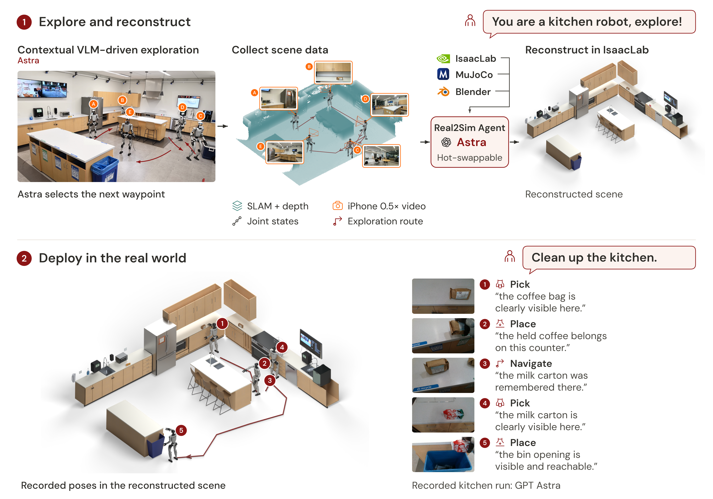

<h1 align="center">HomeBody: A Humanoid That Explores, Remembers, and Acts on Its Own</h1>

  <a href="https://www.linkedin.com/in/gio-huh-789188374/">Gio Huh</a>1 &nbsp;&nbsp;
  <a href="https://www.linkedin.com/in/caydengu/">Cayden Gu</a>2 &nbsp;&nbsp;
  <a href="https://www.takaratruong.com/">Takara E. Truong</a>2 &nbsp;&nbsp;
  <a href="https://profiles.stanford.edu/c-karen-liu">C. Karen Liu</a>2,† &nbsp;&nbsp;
  <a href="https://guytevet.github.io/">Guy Tevet</a>2,†

  1 Caltech &nbsp; 2 Stanford University &nbsp; † Equal advising

  

  

### Code release schedule

| Target date | Release | Scope | Status |
|---|---|---|---|
| October 4, 2026 | **SIM** | Simulation environment with navigation and pick-and-place. | Planned |
| October 11, 2026 | **REAL2SIM** | Exploration and scene-reconstruction pipeline. | Planned |
| October 18, 2026 | **REAL** | Real-world deployment code and setup instructions. | Planned |
